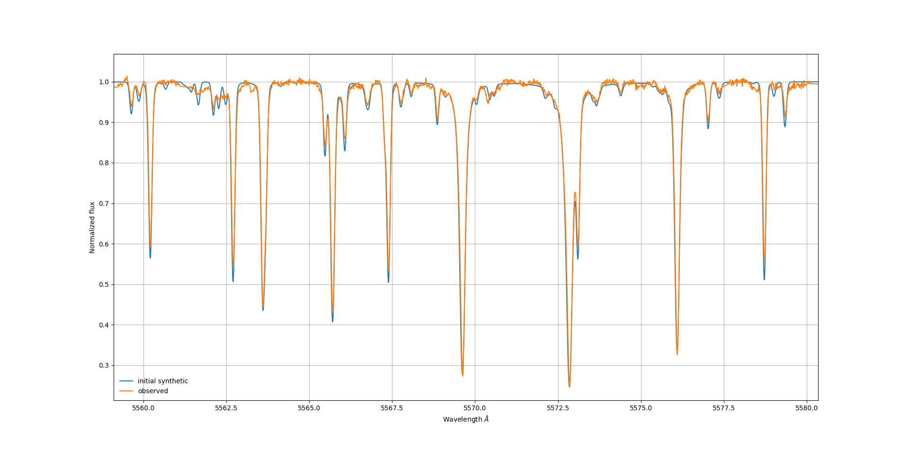

# Summary

Effective temperature (Teff), surface gravity (logg), and metallicity ([M/H]) are basic stellar atmospheric parameters necessary to characterize a star. Once these parameters are obtained, we can in turn, infer chemical abundances of various elements. In this work, we use spectroscopy as a powerful tool to extract this information from stellar atmospheres for stars with spectral type FGK both dwarfs and giants.

``FASMA`` is a Python package to derive stellar atmospheric parameters based on the spectral synthesis technique. The principle of this technique relies on the comparison between synthetic spectra with observations to yield the best-fit parameters under a minimization process.

The synthetic spectra are created on-the-fly with a radiative transfer code, [``MOOG``](https://www.as.utexas.edu/~chris/moog.html) [@Sneden:1973, @Sneden:2012] in fortran for a set of stellar parameters. The synthetic spectra are later convolved with different rotational profiles, such as macroturbulence (vmac), projected rotational velocity (vsini), and instrumental broadening (resolution) to match the observations. Spectral synthesis has model dependence and thus, grids of pre-computed stellar atmospheres (e.g. Kurucz [@Kurucz:1993] or marcs [@Gustafsson:2008] models) are provided with ``FASMA`` along this the interpolation processes for the models (stellar atmospheres) in the grid.

A key component for spectral synthesis is the list of atoms and molecules which are included in the wavelength intervals. The spectral line list required for the derivation of stellar parameters is described in @Tsantaki:2018 and for the chemical abundances is taken from @Adibekyan:2015.

Before we compare with observations, we perform a local normalization for the regions of the synthesis and filter out cosmic rays. The minimization process is based on the Levenberg-Marquardt algorithm [@Marquardt:1963]. The procedure to derive stellar parameters is presented in detail in [@Tsantaki:2018] and has been tested for medium and high resolution spectrographs. In this version, we now include a new feature to derive chemical abundances for the following elements: Na, Mg, Al, Si, Ca, Sc, Ti, V, Cr, Mn, and Ni. For this process, stellar parameters have to be set and the only free parameter is the abundance of each element. The abundances are calculated in a region of &pm;2m &angst; around each spectral line. The line list of the neighboring lines is taken from [VALD](http://vald.astro.uu.se/~vald/php/vald.php) [@Ryabchikova:2015]

``FASMA`` includes a GUI for a more user-friendly approach but can also run via terminal by setting the configuration file. ``FASMA`` incorporates all the standard inputs for spectral synthesis along with a manual for the derivation of stellar parameters and chemical abundances, the user has to provide only the stellar spectrum for the analysis.

# Figures

Synthetic spectrum with solar values generated with ``FASMA`` (blue) compared with observed spectrum (orange).

# Acknowledgements

We acknowledge contributions from V. Adibekyan, H. Tabernero, and E. Delgado-Mena. This research made use of the Vienna Atomic Line Database operated at Uppsala University, the Institute of Astronomy RAS in Moscow, and the University of Vienna. We thank the PyAstronomy and Astropy communities.

# References
